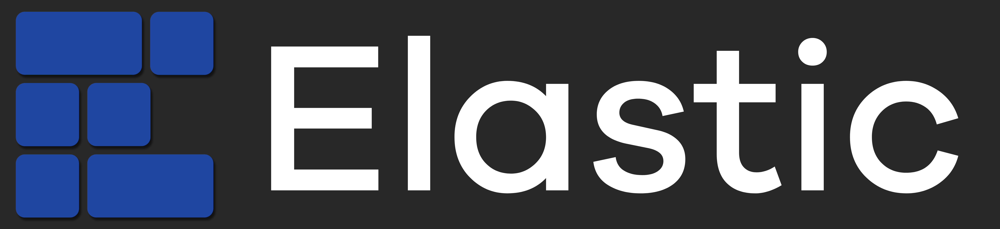

# 

 

A simple and modern dashboard for FRC.

Download files can be found [here](https://github.com/Gold872/elastic-dashboard/releases/latest), the supported platforms are Windows, MacOS, and Linux.

_Important Notes/Warnings:_ 
* _Your robot code must be using WPILib version 2023.3.1 or higher, otherwise you might not be able to add widgets._
    * _WPILib v2023.3.1 fixed a bug in Network Tables where values wouldn't be sent to a client after subscribing topics only. Since the program subscribes topics only to everything, any widget that is built using a sendable will not be possible to add since the program will not be able to retrieve the widget's type. See https://github.com/wpilibsuite/allwpilib/pull/4991 for more info._

## About

Elastic is a simple and modern Shuffleboard alternative made by Team 353. It is meant to serve as a dashboard for competition but can also be used for testing. Some features include

- Viewing data from different NT4 topics and widgets
- Draggable and resizable card widgets
- Customizable color scheme
- Automatic IP retrieval from the FRC Driver Station
- Compatibility with the WPILib Shuffleboard API

## Documentation
View the online documentation [here](https://frc-elastic.gitbook.io/docs)

## Special Thanks

This dashboard wouldn't have been made without the help and inspiration from the following people

* [Michael Jansen](https://github.com/mjansen4857) from Team 3015
* [Jonah](https://github.com/jwbonner) from Team 6328
* [Oh yes 10 FPS](https://github.com/oh-yes-0-fps) from Team 3173
* [Jason](https://github.com/jasondaming) and [Peter](https://github.com/PeterJohnson) from WPILib
* [MikLast](https://www.chiefdelphi.com/u/MikLast), FRC Alum, Mentor, & Volunteer
    * Created all of the field images that were used in this program:
        * [Power Up](https://www.chiefdelphi.com/t/pic-top-down-orthographic-view-of-the-field/161896)
        * [Destination: Deep Space](https://www.chiefdelphi.com/t/8k-2019-top-down-orthographic-field-views/337019)
        * [Infinite Recharge](https://www.chiefdelphi.com/t/2020-top-down-orthographic-field-views/369892)
        * [Rapid React](https://www.chiefdelphi.com/t/2022-top-down-field-renders/399031)
        * [Charged Up](https://www.chiefdelphi.com/t/2023-top-down-field-renders/421365)
        * [Crescendo](https://www.chiefdelphi.com/t/2024-crescendo-top-down-field-renders/447764)
* All mentors and advisors of Team 353, the POBots
