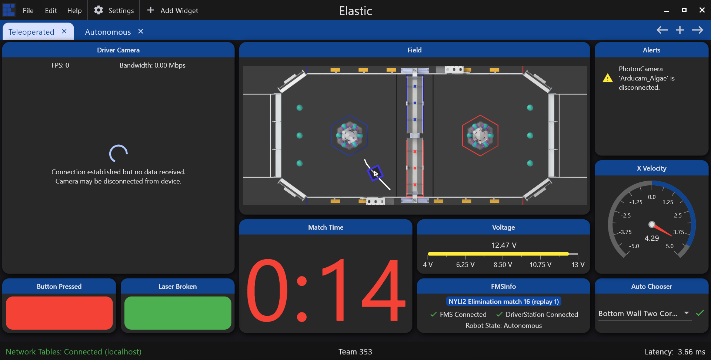

# Home

Elastic is a simple and modern dashboard for FRC. It was built with the goal of being a drag & drop dashboard with an easy setup and elegant UI designed for a high pressure competition environment.

<figure><figcaption></figcaption></figure>

### Getting Started

<table data-view="cards"><thead><tr><th align="center"></th><th></th><th></th><th data-hidden data-card-target data-type="content-ref"></th></tr></thead><tbody><tr><td align="center">App Navigation</td><td></td><td></td><td><a href="getting-started/app-navigation.md">app-navigation.md</a></td></tr><tr><td align="center">Connecting to your Robot</td><td></td><td>              </td><td><a href="getting-started/connecting-to-your-robot.md">connecting-to-your-robot.md</a></td></tr></tbody></table>

### Creating and Customizing your Dashboard

<table data-view="cards"><thead><tr><th></th><th></th><th></th><th data-hidden data-card-target data-type="content-ref"></th></tr></thead><tbody><tr><td>Adding and Customizing Widgets</td><td></td><td></td><td><a href="customizing-your-dashboard/adding-and-customizing-widgets.md">adding-and-customizing-widgets.md</a></td></tr><tr><td>Adding and Customizing Layouts</td><td></td><td></td><td><a href="customizing-your-dashboard/adding-and-customizing-layouts.md">adding-and-customizing-layouts.md</a></td></tr></tbody></table>

### Features & References

<table data-view="cards"><thead><tr><th></th><th></th><th></th><th data-hidden data-card-target data-type="content-ref"></th></tr></thead><tbody><tr><td>Widgets List &#x26; Properties Reference</td><td></td><td></td><td><a href="additional-features-and-references/widgets-list-and-properties-reference.md">widgets-list-and-properties-reference.md</a></td></tr><tr><td>Shuffleboard API Integration</td><td></td><td></td><td><a href="additional-features-and-references/shuffleboard-api-integration.md">shuffleboard-api-integration.md</a></td></tr><tr><td>Robot Notifications</td><td></td><td></td><td><a href="additional-features-and-references/robot-notifications-with-elasticlib.md">robot-notifications-with-elasticlib.md</a></td></tr></tbody></table>
