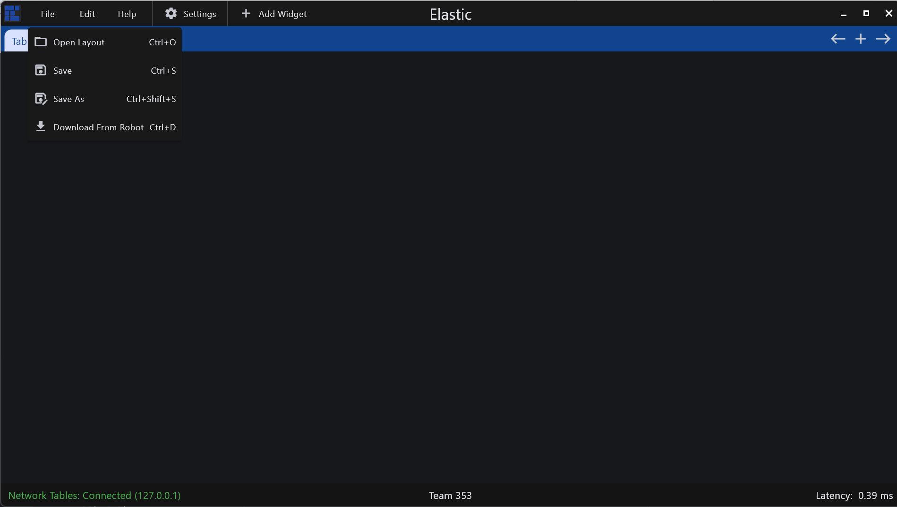
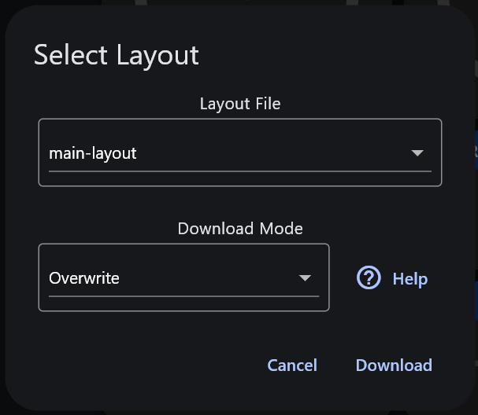

# Remote Layout Downloading

For situations where you want to load a dashboard layout from your robot, Elastic supports downloading a layout remotely and merging it with your current layout.

## On-Robot Configuration

In your robot code, add the following line in `robotInit()` or another initialization function



```java
WebServer.start(5800, Filesystem.getDeployDirectory().getPath());
```



```cpp
WebServer::GetInstance().Start(5800, frc::Filesystem::GetDeployDirectory());
```



Next, you will have to deploy the Elastic configuration file to your robot:

1. Export the layout from Elastic
2. Move the exported json file into the deploy folder of your robot project
3. Deploy your robot code


The name of the exported json file MUST be "elastic-layout.json", and should be placed at the root directory of your deploy folder, the folder structure should look like this:

/deploy\
&#x20;   elastic-layout.json\
&#x20;   ...


## Downloading Your Layout

To download the layout to your dashboard, enter the `File` menu, and click `Load Layout From Robot`

<figure><figcaption></figcaption></figure>

Alternatively, you can use the shortcut `Ctrl + D`

A dialog will appear with 2 dropdown menus, one to select which layout to download, and another to select how you want to download the data.

<figure><figcaption></figcaption></figure>


The layout file dropdown will display the name of any file in the root of your robot project deploy directory that ends with `.json`, if you aren't seeing your layout, ensure that your file is in the root of your deploy directory and the file ends with `.json`


### Download Modes

<details>

<summary>Overwrite</summary>

Keeps existing tabs that are not defined in the remote layout. However, any tabs that are defined in the remote layout will be overwritten locally.

For example, if your current layout has the tabs `Teleoperated`, `Autonomous`, and `Testing`, and your layout defines a tab named `Testing`, after downloading, any content that you have on the `Testing`tab will no longer exist and will be overwritten by whatever is on the remote layout tab.

</details>

<details>

<summary>Merge</summary>

Merge the downloaded layout with the existing one. If a new widget cannot be properly placed, it will not be added.

If your current layout has the tabs `Teleoperated`, `Autonomous`, and `Testing`, and your layout defines a tab named `Testing`, but the layout you are downloading also has a tab named `Testing`, any widgets you currently have on the `Testing` tab will remain, but new widgets will be added in spots that are not occupied.

</details>

<details>

<summary>Full Reload</summary>

Deletes the existing layout and loads the new one.

This is the same operation as opening a new layout locally, any widgets you have placed will be removed.

</details>

## Shuffleboard API Migration Guide

### Code-Driven Layouts

Migrating Shuffleboard API layouts to remote downloading layouts is simple:

1. Clear all tabs and widgets of your dashboard, it is recommended you save your layout to a safe location before doing this step
2. Connect to your robot to populate Elastic with the code-driven layout
3. Export your dashboard layout
4. Set up the remote layout downloading as described [here](remote-layout-downloading.md#on-robot-configuration)

After migrating your layout, it is advised to remove any Shuffleboard API-related code from your robot project.
