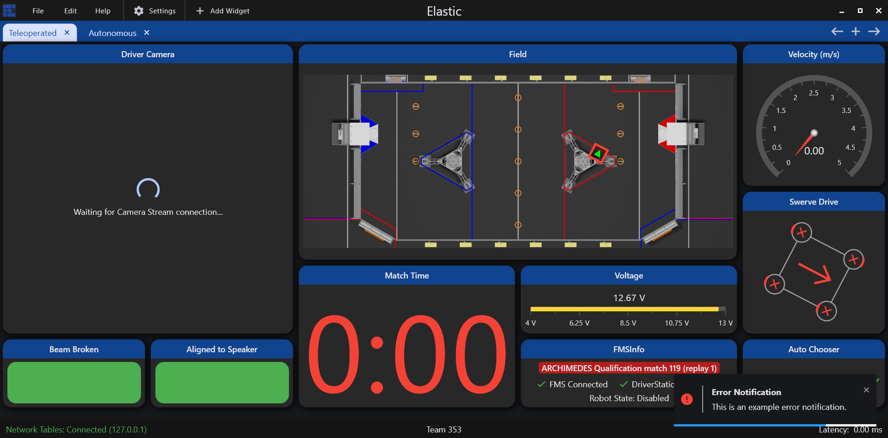

# ElasticLib

## Installing ElasticLib

For Java projects, copy this file into your robot project: [https://github.com/Gold872/elastic-dashboard/blob/main/elasticlib/Elastic.java](https://github.com/Gold872/elastic-dashboard/blob/main/elasticlib/Elastic.java)

If you are using C++, you will have to copy these 2 files instead:&#x20;

1. [https://github.com/Gold872/elastic-dashboard/blob/main/elasticlib/elasticlib.h](https://github.com/Gold872/elastic-dashboard/blob/main/elasticlib/elasticlib.h)
2. [https://github.com/Gold872/elastic-dashboard/blob/main/elasticlib/elasticlib.cpp](https://github.com/Gold872/elastic-dashboard/blob/main/elasticlib/elasticlib.cpp)

For Python projects, you will have to copy this file: [https://github.com/Gold872/elastic-dashboard/blob/main/elasticlib/elasticlib.py](https://github.com/Gold872/elastic-dashboard/blob/main/elasticlib/elasticlib.py)

It is recommended to put this in a folder called `util`, however any location within a robot project works. Depending on where the file is located, you may need to change the top line of the file.

## Robot Notifications

Elastic supports sending notifications to the dashboard via robot code. This could be helpful in situations where you want to grab the attention of the user when something goes wrong or if there's an important warning to display.

Sending notifications via robot code requires the use of ElasticLib. Currently the only supported languages are Java and C++, but contributions for a Python port are open.

### Creating a Notification

Notification data is stored in an object called `Notification`. Currently, this has the following properties:

* `level` for the type of notification
* `title` for the notification title
* `description` for the notification text
* `width` for the notification width (optional)
* `height` for the notification height (optional)
* `displayTimeMillis` for the time to show the notification in milliseconds (optional)

There are 3 notification levels:

1. Error
2. Warning
3. Info

An example of a `Notification` for an error notification would be



<pre class="language-java"><code class="lang-java"><strong>Elastic.Notification notification = new Elastic.Notification(Elastic.NotificationLevel.ERROR, "Error Notification", "This is an example error notification.");
</strong></code></pre>



<pre class="language-cpp"><code class="lang-cpp"><strong>elastic::Notification notification = {.level = elastic::NotificationLevel::ERROR, .title = "Error Notification", .description = "This is an example error notification"};
</strong></code></pre>



```python
notification = Notification(level=NotificationLevel.ERROR, title="Error Notification", description="This is an example error notification")
```



### Sending a notification

In order to send a notification, there is a method called `sendNotification`in the `Elastic` class to send a `Notification`.

To send the error notification that was declared above, you would call



```java
Elastic.sendNotification(notification);
```



```cpp
elastic::SendNotification(notification);
```



```python
send_notification(notification)
```



When this is called, a popup will appear on the dashboard that looks like this



### Customizing a Notification

Notifications and their settings can be customized after being created, allowing them to be reused.

For example, the error notification created above can be customized into a warning notification.



```java
/* code that created the notification */
notification.setLevel(NotificationLevel.WARNING);
notification.setTitle("Warning Notification");
notification.setDescription("This is an example warning notification");
```



```cpp
/* code that created the notification */
notification.level = elastic::NotificationLevel::WARNING;
notification.title = "Warning Notification";
notification.description = "This is an example warning notification";
```



```python
# code that created the notification
notification.level = NotificationLevel.WARNING
notification.title = "Warning Notification"
notification.description = "This is an example warning notification"
```



#### Customizing with Method Chaining (Java Only)

For Java, method chaining is the simpler and recommended way to customize notifications. This allows for customizing multiple properties with just one line of code, as well as reusing only one notification object, which is better for the Java Garbage Collector performance (see [WPILib docs](https://docs.wpilib.org/en/stable/docs/software/basic-programming/java-gc.html) for more details)

For example, here's how a notification can be entirely customized and sent with just one line of code.

```java
Elastic.Notification notification = new Elastic.Notification();

/* ... */

Elastic.sendNotification(notification
    .withLevel(Elastic.NotificationLevel.INFO)
    .withTitle("Some Information")
    .withDescription("Your robot is doing fantastic!")
    .withDisplaySeconds(5.0)
);
```

## Tab Switching

ElasticLib has functions to request the dashboard to switch the tab remotely.

To switch to a tab, use the `selectTab`method



```java
Elastic.selectTab("Example Tab");
```



```java
elastic::SelectTab("Example Tab");
```



```python
select_tab("Example Tab")
```



Additionally, you can also select a tab at a specific index (with index 0 being the first tab). To do this, pass an integer into the `selectTab` method, for Python, use the `select_tab_index` method.



<pre class="language-java"><code class="lang-java"><strong>// Select the tab at index 3 (the 4th tab)
</strong><strong>Elastic.selectTab(3);
</strong></code></pre>



```cpp
// Select the tab at index 3 (the 4th tab)
elastic::SelectTab(3);
```



```python
# Select the tab at index 3 (the 4th tab)
select_tab_index(3)
```


