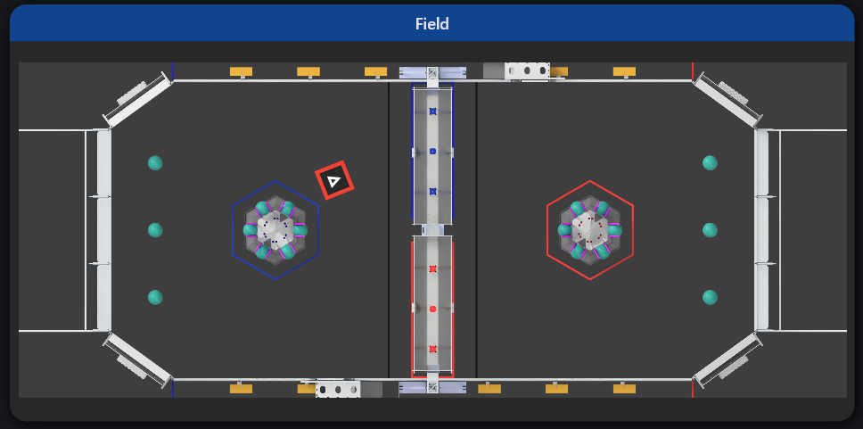
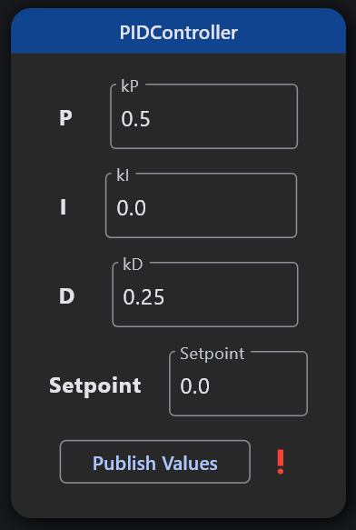

---
layout:
  title:
    visible: true
  description:
    visible: true
  tableOfContents:
    visible: true
  outline:
    visible: true
  pagination:
    visible: true
---

# Widgets List & Properties Reference

### Information about Properties

Every widget has properties, with settings such as where to receive information, update frequency, and unique customization options. By default, every widget has 2 properties, `topic` (String), and `period` (double).

The `topic` property specifies where to stream data from on NetworkTables, and `period` determines the update frequency of the widget.

## Single-Topic Widgets

These are widgets that only display data from one topic. They subscribe to the topic and display the raw data sent in the desired format.

### Text Display

Displays data in a text field. This text can be edited to update the data on Network Tables, it supports displaying and editing the following data types:

* `boolean`
* `float`
* `double`
* `int`
* `float[]`
* `double[]`
* `int[]`
* `boolean[]`

#### Properties

* `show_submit_button` - Whether or not to show a button to publish the entered data to network tables (defaults to false)
  * `true` or `false`

### Number Slider

Displays a number in the form of a slider. The slider can be dragged to edit the value on Network Tables. It can be customized with different ranges and intervals. This supports the `double` data type.

#### Properties

* `min_value` - The minimum value of the number slider (defaults to -1.0)
  * Decimal number
* `max_value` - The maximum value of the number slider (defaults to 1.0)
  * Decimal number
* `divisions` - The number of divisions between the minimum and maximum (defaults to 5)
  * Positive whole number
* `publish_all` - Whether or not to publish the slider value when dragging (defaults to false)
  * `true` or `false`

### Number Bar

Similar to the Number Slider, but does not support editing values.

#### Properties

* `min_value` - The minimum value of the number bar (defaults to -1.0)
  * Decimal number
* `max_value` - The maximum value of the number bar (defaults to 1.0)
  * Decimal number
* `divisions` - The number of divisions between the minimum and maximum (defaults to 5)
  * Positive whole number
* `inverted` - Whether or not the bar should be inverted (defaults to false)
  * `true` or `false`
* `orientation` - The bar's orientation (defaults to horizontal)
  * `horizontal` or `vertical` (String)

### Voltage View

Displays a yellow number bar with the V units next to it, which is particularly useful for viewing the robot's voltage.

#### Properties

* `min_value` - The minimum value of the number bar (defaults to 4.0)
  * Decimal number
* `max_value` - The maximum value of the number bar (defaults to 13.0)
  * Decimal number
* `divisions` - The number of divisions between the minimum and maximum (defaults to 5)
  * Positive whole number
* `inverted` - Whether or not the bar should be inverted (defaults to false)
  * `true` or `false`
* `orientation` - The bar's orientation (defaults to horizontal)
  * `horizontal` or `vertical` (String)

### Radial Gauge

Displays a number in a style similar to a car's speedometer.

#### Properties

* `start_angle` - The angle (in degrees) to start at (defaults to -140.0)
  * Decimal number
* `end_angle` - The angle (in degrees) to end at (defaults to 140.0)
  * Decimal number
* `min_value` - The lowest value to display (defaults to 0.0)
  * Decimal number
* `max_value` - The highest value to display (defaults to 100.0)
  * Decimal number
* `number_of_labels` - The number of labels to display on the gauge (defaults to 8)
  * Positive whole number
* `wrap_value` - Whether or not to wrap the value between the min and max, particularly useful for displaying gyro values (defaults to false)
  * `true` or `false`
* `show_pointer` - Whether or not to show a needle pointing towards the value (defaults to true)
  * `true` or `false`
* `show_ticks` - Whether or not to show tick marks (defaults to true)
  * `true` or `false`

### Graph

Displays a Graph of how data has been changing over time. This can display a line in different colors and over different time intervals.

#### Properties

* `time_displayed` - The amount of time (in seconds) to display the latest data (defaults to 5.0)
  * Decimal number
* `min_value` - The minimum Y value of the graph (defaults to nothing)
  * Decimal number
  * If no value is provided, the graph will dynamically change the minimum Y value depending on the data the graph is displaying
* `max_value` - The maximum Y value of the graph (defaults to nothing)
  * Decimal number
  * If no value is provided, the graph will dynamically change the minimum Y value depending on the data the graph is displaying
* `color` - The color of the line (defaults to light blue)
  * 32 bit int (format: 0xAARRGGBB)
* `line_width` - The width of the line in pixels (defaults to 2.0)
  * Positive decimal number

**32 Bit int information**

* The value starts with 0x, and then the ARGB code
* To obtain the ARGB code, use this [Color Converter](https://www.myfixguide.com/color-converter/)

### Match Time

Displays a very large number that is color coded to how much time is left in a match. Any time above 1 minute will be in blue, below 1 minute will be green, below 30 seconds will be yellow, and 15 and below will be red. This can display time in raw seconds or MM:SS format

#### Properties

* `time_display_mode` - The format the time should be displayed in (defaults to "Minutes and Seconds")
  * `Minutes and Seconds` or `Seconds Only`
* `red_start_time` - The time in seconds when the text will display in the color red (defaults to 15)
  * Whole number
* `yellow_start_time` - The time in seconds when the text will display in the color yellow (defaults to 30)
  * Whole number

### Boolean Box

The simplest of all the widgets. Displays a color when the value is true, and a different color when the value is false. These colors default to red and green, but can be changed as you wish.

#### Properties

* `true_color` - the Color to display when the value is "true" (defaults to green)
  * 32 bit int (format: 0xAARRGGBB)
* `false_color` - the color to display when the value is "false" (defaults to red)
  * 32 bit int (format: 0xAARRGGBB)

**32 Bit int information**

* The value starts with 0x, and then the ARGB code
* To obtain the ARGB code, use this [Color Converter](https://www.myfixguide.com/color-converter/)

### Toggle Button

Displays a boolean value in the form of a button. This button can be pressed to switch the boolean value from true to false and vice versa.

### Toggle Switch

Displays a boolean value in the form of a switch. This switch can be toggled in order to invert the value.

### Single Color View

_This is a custom widget, for code examples on how to display this, see_ [_Custom Widget Examples_](https://github.com/Gold872/elastic-dashboard/wiki/Custom-Widget-Examples)

This displays any color in a box. This can be very useful for seeing what a color sensor is detecting, or a color seen by a vision tracking camera.

This widget will show as an option on any widget displaying data that is a String. In order for this to display a color, the string must be formatted as "#RRGGBB". It is recommended to use the `toHexString()` method in WPILib's Color class ([Java](https://github.wpilib.org/allwpilib/docs/release/java/edu/wpi/first/wpilibj/util/Color.html#toHexString\(\)), [C++](https://github.wpilib.org/allwpilib/docs/release/cpp/classfrc_1_1_color.html#a37cd7691c1112518974d178f211f7397)) in order to obtain this hex code.

### Multi Color View

Displays a gradient of multiple colors. Will display on a topic with the `string[]` type if every string is a color hex code.

This widget will show as an option on any widget displaying data that is a String array. In order for this to display a color, the elements in the array must be formatted as "#RRGGBB". It is recommended to use the `toHexString()` method in WPILib's Color class ([Java](https://github.wpilib.org/allwpilib/docs/release/java/edu/wpi/first/wpilibj/util/Color.html#toHexString\(\)), [C++](https://github.wpilib.org/allwpilib/docs/release/cpp/classfrc_1_1_color.html#a37cd7691c1112518974d178f211f7397)) in order to obtain these hex codes.

## Multi-Topic Widgets

These widgets display data from multiple topics. Most of these are built from Sendables in robot code, which is the recommended way of having these added to Network Tables.

### 3-Axis Accelerometer

Built from the WPILib BuiltInAccelerometer ([Java](https://github.wpilib.org/allwpilib/docs/release/java/edu/wpi/first/wpilibj/BuiltInAccelerometer.html), [C++](https://github.wpilib.org/allwpilib/docs/release/cpp/classfrc_1_1_built_in_accelerometer.html)), displays the X, Y, and Z acceleration of an accelerometer.

### Accelerometer

Displays data from any 1-axis accelerometer.

### Camera Stream

Shows a live camera view from Camera Server. It is recommended to use a very low stream resolution as high resolution video can heavily affect performance.

#### Properties

* `compression` - The quality of the image between 0 and 100, with 0 being lowest quality, and 100 being the highest quality, defaults to null
  * Whole number
* `fps` - How many frames per second should be sent from the server, defaults to null
  * Whole number
* `resolution` - The resolution to apply to the stream, defaults to null
  * Integer array, in the format `[width, height]`

### ComboBox Chooser

Built from WPILib's Sendable Chooser ([Java](https://github.wpilib.org/allwpilib/docs/release/java/edu/wpi/first/wpilibj/smartdashboard/SendableChooser.html), [C++](https://github.wpilib.org/allwpilib/docs/release/cpp/classfrc_1_1_sendable_chooser.html)), provides a dropdown list of all of the options, and the ability to search for an option. If the name of it is too long, hovering over the widget will reveal a tooltip showing the full name of the selected option.

#### Properties

* `sort_options` - Whether or not to sort the options alphabetically, defaults to false
  * `true`or `false`

### Split Button Chooser

Also built from WPILib's Sendable Chooser ([Java](https://github.wpilib.org/allwpilib/docs/release/java/edu/wpi/first/wpilibj/smartdashboard/SendableChooser.html), [C++](https://github.wpilib.org/allwpilib/docs/release/cpp/classfrc_1_1_sendable_chooser.html)), provides a list of all of the options as a row of buttons which can be scrolled left and right.

### Command Scheduler

Displays a list of all of the commands scheduled, along with their IDs and a button to unschedule them. This is created using WPILib's CommandScheduler ([Java](https://github.wpilib.org/allwpilib/docs/release/java/edu/wpi/first/wpilibj2/command/CommandScheduler.html), [C++](https://github.wpilib.org/allwpilib/docs/release/cpp/classfrc2_1_1_command_scheduler.html))

### Command

Displays a button to run a command.

#### Properties

* `show_type` - Whether or not to show text that says the type of command (defaults to true)
  * `true` or `false`

### Subsystem

Displays information about a robot subsystem.

### DifferentialDrive

Built from the WPILib DifferentialDrive ([Java](https://github.wpilib.org/allwpilib/docs/release/java/edu/wpi/first/wpilibj/drive/DifferentialDrive.html), [C++](https://github.wpilib.org/allwpilib/docs/release/cpp/classfrc_1_1_differential_drive.html)), it displays the wheel speeds of a differential drivetrain along with a curved arrow showing its direction. The sliders on the left and right can be dragged to set the speeds of each wheel (only works when Live Window is enabled).

### SwerveDrive

_This is a custom widget, for code examples on how to display this, see_ [_Custom Widget Examples_](https://github.com/Gold872/elastic-dashboard/wiki/Custom-Widget-Examples)

Displays the wheel rotation and velocity of a swerve drivetrain, along with the robot's rotation. There is also a similar widget that can display data from any robot program using the YAGSL library more info in the [Custom Widget Examples](https://github.com/Gold872/elastic-dashboard/wiki/Custom-Widget-Examples) page.

#### Properties

* `show_robot_rotation` - whether or not to rotate the robot in the widget (defaults to true)
  * `true` or `false`
* `rotation_unit` - The unit to use for the rotation of the modules and robot (defaults to "Radians")
  * Must be one of the following:
    * `Radians`
    * `Degrees`
    * `Rotations`
  * This option is not available on the YAGSL widget, as the units are handled automatically via Network Tables

### Encoder

Built from the WPILib Encoder ([Java](https://github.wpilib.org/allwpilib/docs/release/java/edu/wpi/first/wpilibj/Encoder.html), [C++](https://github.wpilib.org/allwpilib/docs/release/cpp/classfrc_1_1_encoder.html)), displays the position and speed of an encoder.

### Field

Built from the WPILib Field2d ([Java](https://github.wpilib.org/allwpilib/docs/release/java/edu/wpi/first/wpilibj/smartdashboard/Field2d.html), [C++](https://github.wpilib.org/allwpilib/docs/release/cpp/classfrc_1_1_field2d.html)), displays a field with the robot's position and any other objects to scale. If a field object contains more than 8 elements, it will be displayed as a trajectory, which draws a line representing a path.

#### Properties

* `field_game` - The game's field to show (defaults to "Reefscape")
  * Must be one of the following (case sensitive)
    * Reefscape
    * Crescendo
    * Charged Up
    * Rapid React
    * Infinite Recharge
    * Destination: Deep Space
    * Power Up
* `robot_width` - The width of the robot in meters (defaults to 0.85)
  * Decimal number
* `robot_length` - The length of the robot in meters (defaults to 0.85)
  * Decimal number
* `show_other_objects` - Whether or not to show other field objects that are not trajectories (defaults to true)
  * `true` or `false`
* `show_trajectories` - Whether or not to show trajectories (defaults to true)
  * `true` or `false`
* `field_rotation`- How many degrees to rotate the field, clockwise positive (defaults to 0.0)
  * Decimal number
* `robot_color`- The color of the robot bumpers (defaults to red)
  * 32 bit int (format: 0xAARRGGBB)
* `trajectory_color` - The color of the trajectory (defaults to white)
  * 32 bit int (format: 0xAARRGGBB)

**32 Bit int Information**

* The value starts with 0x, and then the ARGB code
* To obtain the ARGB code, use this [Color Converter](https://www.myfixguide.com/color-converter/)

### FMSInfo

Automatically published to Network Tables by WPILib, displays information about the match, whether or not the robot is enabled, and other info such as FMS connection status and which alliance you are on.

### Gyro

Displays the robot's rotation in the form of a compass-like circular dial.

#### Properties

* `counter_clockwise_positive` - Whether or not the value of the Gyro is CCW+ (Defaults to false)
  * `true` or `false`

### RobotPreferences

Displays anything under the `/Preferences` table when using the Preferences API. Anything submitted in the text boxes will be saved persistent in the Preferences table.

### PIDController

Built from the WPILib PIDController ([Java](https://github.wpilib.org/allwpilib/docs/release/java/edu/wpi/first/math/controller/PIDController.html), [C++](https://github.wpilib.org/allwpilib/docs/release/cpp/classfrc2_1_1_p_i_d_controller.html)), allows editing of the gains and setpoint of a PID controller.

<figure><figcaption></figcaption></figure>

### PowerDistribution

Built from the WPILib PowerDistribution ([Java](https://github.wpilib.org/allwpilib/docs/release/java/edu/wpi/first/wpilibj/PowerDistribution.html), [C++](https://github.wpilib.org/allwpilib/docs/release/cpp/classfrc_1_1_power_distribution.html)), displays the voltage, total current, and current drawn by all channels in a Power Distribution Panel/Hub.

### Relay

Built from the WPILib Relay ([Java](https://github.wpilib.org/allwpilib/docs/release/java/edu/wpi/first/wpilibj/Relay.html), [C++](https://github.wpilib.org/allwpilib/docs/release/cpp/classfrc_1_1_relay.html)), displays the current state of the relay, and allows it to be changed by selecting the different options from the list.

### Ultrasonic

Built from the WPILib Ultrasonic ([Java](https://github.wpilib.org/allwpilib/docs/release/java/edu/wpi/first/wpilibj/Ultrasonic.html), [C++](https://github.wpilib.org/allwpilib/docs/release/cpp/classfrc_1_1_ultrasonic.html)), displays the distance reading from an Ultrasonic widget in inches.

### Alerts

Displays data from WPILib [Network Alerts](https://docs.wpilib.org/en/latest/docs/software/telemetry/persistent-alerts.html).

_NetworkAlerts is being added to WPILib in 2025, robot code using a WPILib version from pre-2025 beta will not have access to the NetworkAlerts API._

