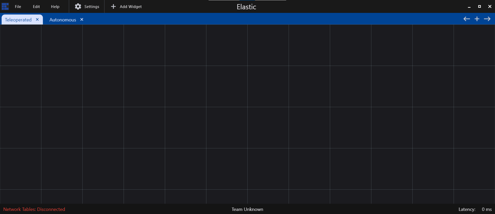
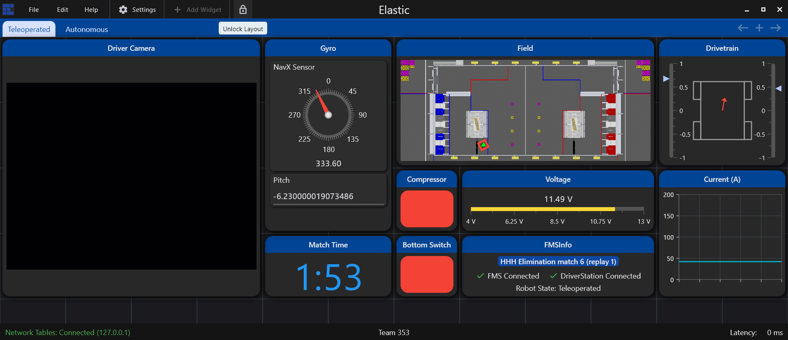

# App Navigation

When the app is first opened, there will be no widgets on the screen, just 2 empty tabs

<figure><figcaption>
On Startup
</figcaption></figure>

### Tab Bar

You click on the name of each tab to switch to that tab, or you can use the shortcut `Ctrl + <Tab Number>`. New tabs can be created using the **+** button on the tab bar, and be closed by clicking the **x** button on the tab.

To rename a tab, simply right click on the tab, click rename, and enter the new name of the tab.

### Saving, Exporting, and Importing

To save your current layout, at the top of your screen, click `File` -> `Save`, or use the shortcut `Ctrl + S`. A message will pop up on the screen once the layout is successfully saved.

When you save the layout, it is stored internally. To export the layout as a JSON file, at the top of your screen, click `File` -> `Export Layout`, or you can use the shortcut `Ctrl + Shift + S`. A file explorer window will pop up, select the location you want to save your file in.

To import a layout from an existing JSON file, click on `File` -> `Open Layout`, or use the shortcut `Ctrl + O`. Select the JSON file that you want to use to import. It is strongly recommended to not modify the JSON file manually unless if you know what you are doing, as incorrect formatting can cause the program to fail when loading.

### Locking Layout

Some widgets such as number sliders can be difficult to control as the widget might be dragged when controlling the slider. Sometimes you might want a way of making sure that no widgets are being modified such as during competitions or driver practice. For these situations, you can lock the layout which prevents widgets from being dragged, modified, or removed.

To lock the layout, click on `Edit` -> `Lock Layout`.

<figure><figcaption></figcaption></figure>

When the layout is locked, there will be a lock icon next to the menu bar. When the layout is locked, you will be unable to add, move, modify widgets, or manage tabs. It's important to note that you also cannot add widgets via the Shuffleboard API as well.

To unlock the layout, simply click the lock icon at the top of the screen.

<figure><figcaption></figcaption></figure>
